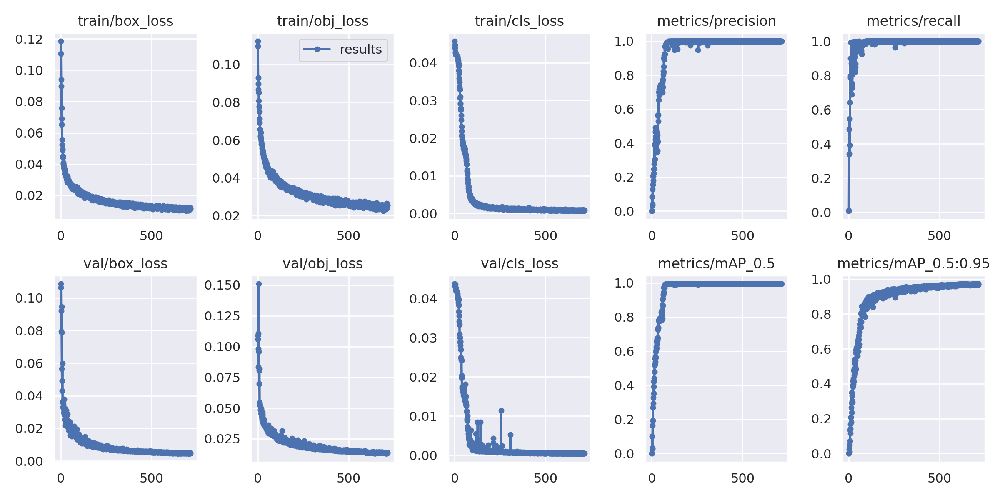
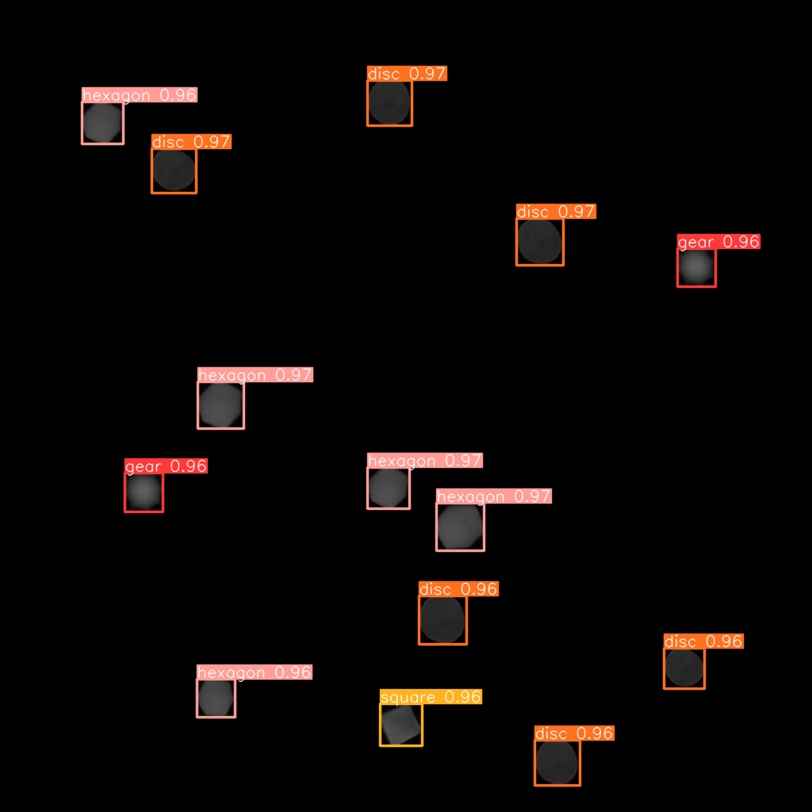
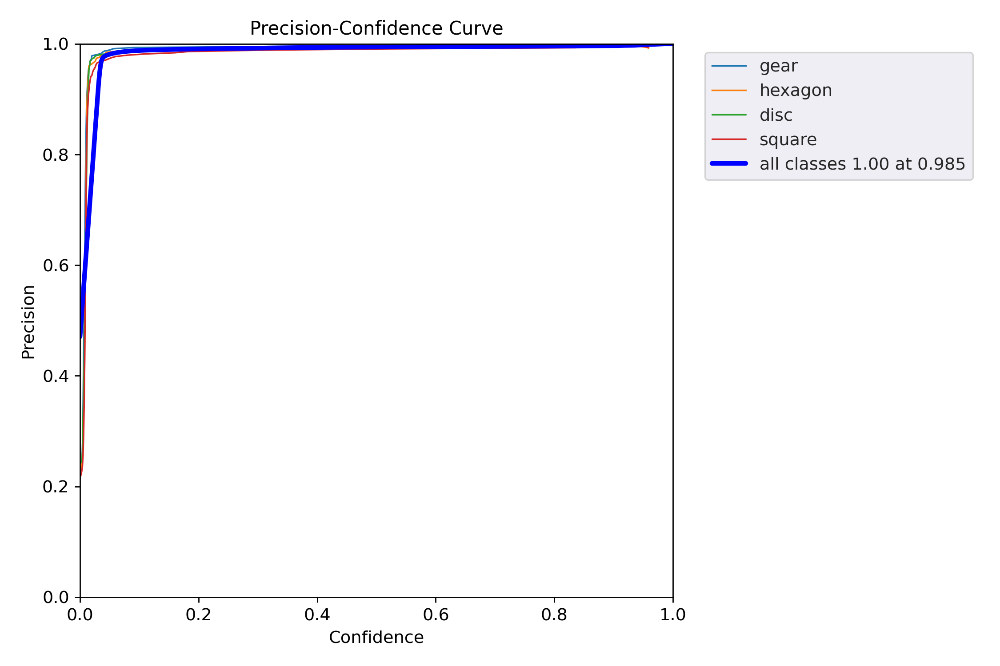
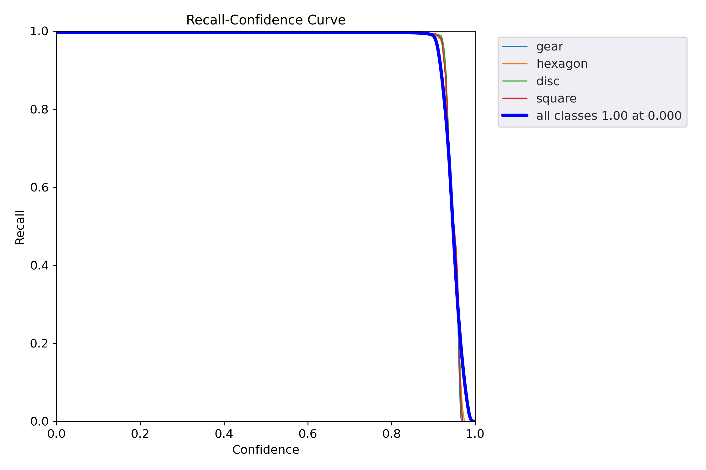
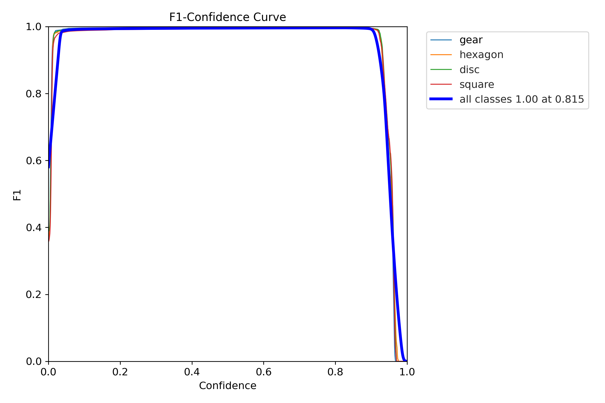
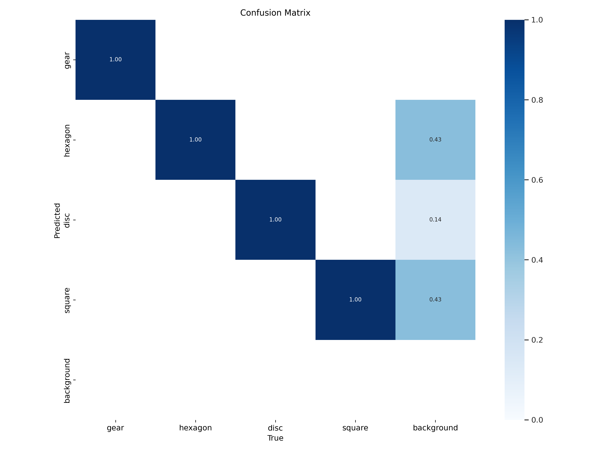

# Achira_Answer

## Part I - Generation file

File - gen_images.py can generate images and labels for them. 
- It randomly selects a point and draws a sqaure of size 64x64 around it, it checks also if it intersects with a previous square and if so removes it.
- A shape is selected randomly from the given list and rotates and resizes it and fixes it in the generated sqaure.
- It uses the points of sqaure and selected shape to generated label in YOLO format - [class, x, y, w, h]

#### usage - python3 gen_images.py --input input_images/ --out-dims 1024 --nout 1000 --labels(if labels are required)

## Part II - DNN

YOLOv5 small has been used, cloned from https://github.com/ultralytics/yolov5  
The YOLO_DNN.ipynb - google colab note contains -  

#### generation of data (train, test, validation)
#### training them using a custom data file - custom.yaml, trainng was done for 715 epochs - 600 trainng images, 40 validation images.
Trained weights can be found [here](https://drive.google.com/file/d/109cX2XfUPwpk4q6_jprPXpRbJjHMNesC/view?usp=share_link)
  
#### function for prediction, generates a result image with bounding boxes over shapes, lists the predicted number of shapes
 
#### Inference cell to get accuracy plots.
 
 
  |  
:-------------------------:|:-------------------------:

 |  
:-------------------------:|:-------------------------:
